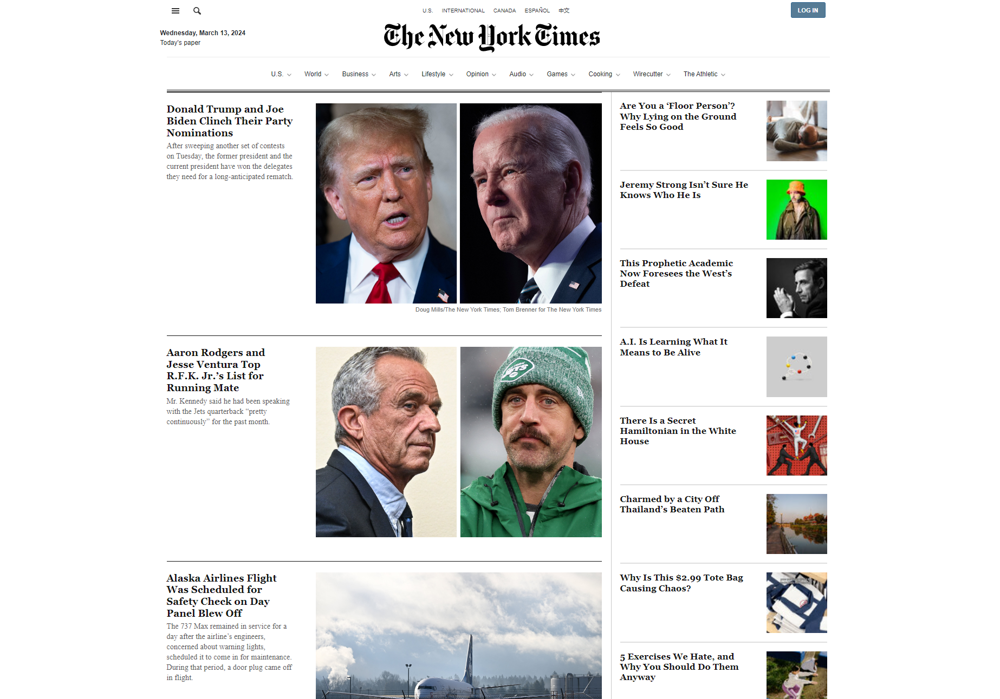

# StartToImpact: [Clone - The New York Times](https://lim-haru.github.io/new-york-times-clone)
## Descrizione
Questo progetto è un clone del sito web The New York Times, realizzato utilizzando React e le API ufficiali del NYT. Offre una replica parziale delle funzionalità e dell'aspetto del sito web originale, consentendo attraverso l'utilizzo della libreria Axios, di ottiene dati aggiornati dagli endpoint delle API per visualizzare gli articoli più recenti, le notizie in primo piano e altro ancora.

### [Presentazione](https://www.canva.com/design/DAF_Z4mQXmI/DRJTGWNLtL-S69XWyK8BNQ/view?utm_content=DAF_Z4mQXmI&utm_campaign=designshare&utm_medium=link&utm_source=editor)

 

## Tecnologie Utilizzate
- React
- API del New York Times
- HTML5
- CSS
- JavaScript
- Axios
- CSS Modules
- Bootstrap
- React Spinners
- Helmet

## Come utilizzare il progetto
1. Clona il repository sul tuo computer:
  ```bash
  git clone https://github.com/lim-haru/clone-the-new-york-times.git
  ```

2. Entrare nella directory del progetto
  ```bash
  cd new-york-times
  ```

3. Installare le dipendenze
  ```bash
  npm install
  ```

4. Crea la variabile ambiente nel tuo sistema o crea un file chiamandolo ".env" all'interno del progetto e inserisci API_KEY fornita da [NYT](https://developer.nytimes.com):
  ```bash
  REACT_APP_API_KEY=""
  ```

5. Avviare l'applicazione
  ```bash
  npm start
  ```
